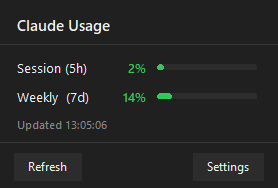

# ClaudeUsageTray

A Windows system tray app that shows your real-time [Claude Code](https://claude.ai/claude-code) usage limits at a glance — inspired by the [macOS menu bar version](https://github.com/adntgv/claude-usage-systray).



## What it shows

| Metric | Description |
|---|---|
| **Session (5h)** | How much of your 5-hour rolling usage limit you've used |
| **Weekly (7d)** | How much of your weekly all-models usage limit you've used |
| **Sonnet (7d)** | Weekly Sonnet-specific usage (shown only when available) |

The tray icon updates every 60 seconds and color-codes by usage level:

- 🟢 **Green** — below warning threshold (default 80%)
- 🟠 **Orange** — between warning and critical (80–90%)
- 🔴 **Red** — above critical threshold (default 90%)

## Features

- **Windows 11 flyout** — slides up from the taskbar with rounded corners and acrylic blur
- **System theme aware** — follows Windows dark/light mode automatically
- **Single-click toggle** — click the tray icon to open or close the flyout
- **No API key needed** — reads your existing Claude Code session token automatically
- **Start with Windows** — optional auto-launch on login
- **Configurable** — adjust thresholds, refresh interval, or paste a token override in Settings

## How it works

The app reads your Claude Code OAuth token from:
```
%USERPROFILE%\.claude\.credentials.json
```
This is the same token Claude Code uses when you're logged in. It calls Anthropic's internal usage API (`GET /api/oauth/usage`) with that token — no separate API key or account setup required.

## Installation

### Option A — Download the exe (recommended)

Download `ClaudeUsageTray.exe` from the [Releases](../../releases) page and run it. No installation needed.

### Option B — Run from source

**Requirements:** Python 3.11+, Claude Code installed and logged in

```bash
git clone https://github.com/aunen88/claude-usage-tray-windows
cd claude-usage-tray-windows
pip install -r requirements.txt
python main.py
```

### Option C — Build the exe yourself

```bash
pip install -r requirements.txt
pip install pyinstaller
build.bat
```

Output: `dist\ClaudeUsageTray.exe`

## Usage

- **Left-click** the tray icon → open/close the usage flyout
- **Right-click** → menu with Refresh, Settings, Start with Windows, Exit
- **Settings** → adjust thresholds, refresh interval, or paste a token manually if auto-detection fails

## Troubleshooting

| Symptom | Cause | Fix |
|---|---|---|
| Shows `?` in tray | Token not found or API error | Check the log at `%APPDATA%\ClaudeUsageTray\app.log` |
| Shows `!!` in tray | Auth error | Re-login to Claude Code (`claude auth login`) |
| "Backing off" message | API rate limited | Wait — it retries automatically with exponential backoff |
| Stale data (grey icon) | Network unreachable | Last known values shown; recovers automatically |

## Requirements

- Windows 10 (build 17134+) or Windows 11
- Claude Code installed and logged in
- Python 3.11+ (if running from source)

Rounded corners and acrylic blur require Windows 11. On Windows 10 the flyout falls back to a solid background.

## Project structure

```
main.py           # App entry point, tray setup, polling loop
api.py            # Token discovery and /api/oauth/usage call
icon_renderer.py  # Pillow-based tray icon (2× supersampled)
popup.py          # DetailWindow (flyout) + SettingsWindow
win32_ui.py       # DWM rounded corners, acrylic blur, theme detection
config.py         # Settings load/save, Windows startup registry
build.bat         # PyInstaller build script
requirements.txt
tests/            # Unit tests (pytest)
```

## Credits

- Inspired by [claude-usage-systray](https://github.com/adntgv/claude-usage-systray) for macOS by [@adntgv](https://github.com/adntgv)
- Built with [pystray](https://github.com/moses-palmer/pystray), [Pillow](https://python-pillow.org/), and [requests](https://requests.readthedocs.io/)

## License

MIT
