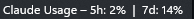
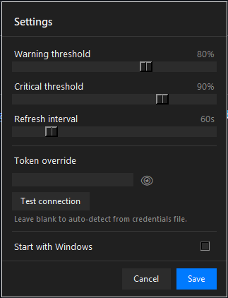

# ClaudeUsageTray

A Windows system tray app that shows your [Claude Code](https://claude.ai/claude-code) usage limits. Inspired by the [macOS menu bar version](https://github.com/adntgv/claude-usage-systray).





## What it shows

| Metric | Description |
|---|---|
| Session (5h) | How much of your 5-hour rolling limit you've used |
| Weekly (7d) | Your weekly all-models usage |
| Sonnet (7d) | Weekly Sonnet-specific usage (when available) |

The tray icon color changes based on how close you are to your limits:

- Green: below warning threshold (default 80%)
- Orange: between warning and critical (80-90%)
- Red: above critical (default 90%)

## Features

- Flyout panel slides up from the taskbar with rounded corners and acrylic blur (Windows 11)
- Follows your Windows dark/light mode
- Click the tray icon to toggle the flyout open or closed
- Reads your Claude Code session token automatically, no API key needed
- Optional auto-launch on login
- Configurable thresholds, refresh interval, and manual token override

## How it works

The app reads your Claude Code OAuth token from:
```
%USERPROFILE%\.claude\.credentials.json
```
It uses the same token Claude Code uses when you're logged in, and calls Anthropic's internal usage endpoint (`GET /api/oauth/usage`). No separate API key or account setup required.

## Installation

### Download the exe

Grab `ClaudeUsageTray.exe` from the [Releases](../../releases) page and run it. No install needed.

### Run from source

Requires Python 3.11+ and Claude Code logged in.

```bash
git clone https://github.com/aunen88/claude-usage-tray-windows
cd claude-usage-tray-windows
pip install -r requirements.txt
python main.py
```

### Build the exe yourself

```bash
pip install -r requirements.txt
pip install pyinstaller
build.bat
```

Output: `dist\ClaudeUsageTray.exe`

## Usage

Left-click the tray icon to open/close the flyout. Right-click for the menu (Refresh, Settings, Start with Windows, Exit). If auto-detection doesn't find your token, paste it manually in Settings.

## Troubleshooting

| Symptom | Cause | Fix |
|---|---|---|
| `?` in tray | Token not found or API error | Check `%APPDATA%\ClaudeUsageTray\app.log` |
| `!!` in tray | Auth error | Re-login to Claude Code (`claude auth login`) |
| "Backing off" | Rate limited | It retries automatically with exponential backoff |
| Grey icon | Network unreachable | Shows last known values, recovers on its own |

## Requirements

- Windows 10 (build 17134+) or Windows 11
- Claude Code installed and logged in
- Python 3.11+ (only if running from source)

Rounded corners and acrylic blur need Windows 11. On Windows 10 the flyout uses a solid background instead.

## Project structure

```
main.py           # App entry point, tray setup, polling loop
api.py            # Token discovery and /api/oauth/usage call
icon_renderer.py  # Pillow-based tray icon (2x supersampled)
popup.py          # DetailWindow (flyout) + SettingsWindow
win32_ui.py       # DWM rounded corners, acrylic blur, theme detection
config.py         # Settings load/save, Windows startup registry
build.bat         # PyInstaller build script
requirements.txt
tests/            # Unit tests (pytest)
```

## Credits

Inspired by [claude-usage-systray](https://github.com/adntgv/claude-usage-systray) for macOS by [@adntgv](https://github.com/adntgv). Built with [pystray](https://github.com/moses-palmer/pystray), [Pillow](https://python-pillow.org/), and [requests](https://requests.readthedocs.io/).

## License

MIT
